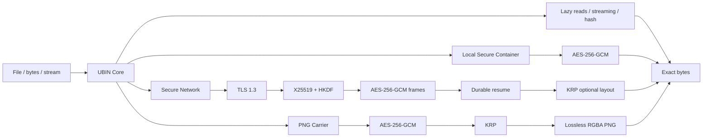

# UBIN v1.0.1 — Universal Binary

[](https://github.com/suryaganesh0509/UBIN/actions/workflows/ci.yml)
[](https://github.com/suryaganesh0509/UBIN/actions/workflows/security.yml)
[](https://github.com/suryaganesh0509/UBIN/actions/workflows/package.yml)
[](https://codecov.io/gh/suryaganesh0509/UBIN)


**UBIN handles the bytes. You handle the logic.**

## Why UBIN exists

Binary-heavy applications often accumulate one-off code paths for file extensions, buffers, streaming, integrity checks, encryption, interrupted transfers, and carrier formats. UBIN exists to put those byte-level concerns behind one small interface while keeping the invariants explicit: unknown formats remain valid input, full-file work stays streaming/bounded where possible, cryptographic security comes from established primitives, and restored output is published only after verification succeeds.

UBIN is not a new cipher and it is not a magical compression algorithm. It is a reference runtime/specification for handling arbitrary bytes consistently across local access, authenticated storage, secure transfer, resume, reversible ciphertext layout, and a lossless PNG carrier.

## Architecture at a glance



UBIN is a Python reference implementation of a simple idea: applications should not need a different low-level byte-handling strategy for every file extension or future format. If a source is a regular file, UBIN can expose it as bytes, inspect it lazily, hash it, protect it, transfer it, resume an interrupted transfer, apply a reversible ciphertext layout, or wrap it in a lossless PNG carrier.

Unknown format **does not** mean unsupported input.

## v1.0.1 compatibility promise

v1.0.1 is an assurance and release-engineering hardening release. It intentionally preserves the public v1.0.0 API and wire/container behavior; the new work is CI, coverage, security scanning, fuzz/property testing, packaging/release automation, portability verification, and documentation.

## Stable v1 feature set

- Universal lazy binary access for arbitrary regular files
- Extension-independent bounded signature detection
- Bounded-memory streaming and positioned reads
- SHA-256 and other `hashlib` hashes
- Local framed AES-256-GCM authenticated containers
- TLS 1.3 client/server transport with certificate verification
- Ephemeral X25519 application key agreement
- HKDF-SHA256 key separation
- Durable interruption-safe resume
- Keyed Reversible Permutation (KRP) of authenticated ciphertext
- Lossless single-file PNG image carrier
- Passphrase-derived image-carrier keys using scrypt + HKDF
- Atomic final publication after authentication/verification
- CLI (`ubin ...`)
- Local browser demonstration (`ubin demo`)
- Manual demos and examples
- Regression/adversarial test suite

## Install

Public install after the PyPI v1.0.1 release is published:

```bash
python3 -m pip install ubin
```

Until the PyPI release is visible, install the exact public GitHub tag:

```bash
python3 -m pip install "git+https://github.com/suryaganesh0509/UBIN.git@v1.0.1"
```

For repository development:

```bash
python3 -m venv .venv
source .venv/bin/activate
python -m pip install --upgrade pip
python -m pip install -e ".[dev,security]"
```

Verify:

```bash
python -c "import ubin; print(ubin.__version__)"
```

Expected:

```text
1.0.1
```

UBIN intentionally does **not** require NumPy. Raw file/byte handling does not need it, and avoiding a mandatory NumPy dependency keeps installation and memory overhead lower. The runtime dependency required by the security implementation is declared in `pyproject.toml` and is installed automatically.

## 30-second Python API

### 1. Open any file

```python
import ubin

with ubin.open("anything.futureXYZ") as obj:
    print(obj.info())
    print(obj.read_at(0, 64))
    print(obj.hash("sha256"))
```

The filename extension is not used to decide whether the input is accepted.

The same `ubin.open(...)` entry point also accepts bytes-like memory and seekable binary streams:

```python
import io
import ubin

packet = ubin.open(b"raw bytes", name="packet.bin")
stream = ubin.open(io.BytesIO(b"stream bytes"), name="stream.bin")

print(packet.hash())
print(stream.read_at(0, 6))
```

Caller-provided streams are not closed by UBIN when the UBIN view is closed.

### 2. Stream a huge file with bounded memory

```python
import ubin

with ubin.open("huge.bin") as obj:
    for block in obj.stream(block_size=1024 * 1024):
        process(block)
```

### 3. Create a local authenticated secure container

```python
import ubin

receipt = ubin.secure("document.pdf").save("document.ubs")

ubin.decrypt(
    "document.ubs",
    "document-restored.pdf",
    key=receipt.key,
)
```

The `receipt.key` path exists for the legacy/local container API. Normal network transfer does not expose or require a raw encryption key.

### 4. Secure client/server transfer with resume + KRP

Client:

```python
import ubin

receipt = ubin.secure("large.bin").send(
    "server.example",
    port=9443,
    cafile="trusted-ca.pem",
    resume=True,
    permutation=True,
)

print(receipt.sha256)
```

Server:

```python
import ubin

server = ubin.secure_server(
    host="0.0.0.0",
    port=9443,
    certfile="server-cert.pem",
    keyfile="server-key.pem",
    output_dir="received",
)

receipt = server.serve_once()
print(receipt.output)
```

Use production certificate infrastructure for real deployments. The included certificate generator is only for localhost demonstrations/tests.

### 5. Final v1 feature: one encrypted PNG carrier

```python
import ubin

packed = ubin.to_image(
    "anything.bin",
    "anything.ubin.png",
    passphrase="a long private passphrase",
)

restored = ubin.from_image(
    "anything.ubin.png",
    "anything-restored.bin",
    passphrase="a long private passphrase",
)

print(packed.sha256)
print(restored.sha256)
```

Or let UBIN restore using the original basename stored in the carrier metadata:

```python
ubin.from_image(
    "anything.ubin.png",
    passphrase="a long private passphrase",
)
```

## What the PNG carrier actually does

```text
source file
   ↓
framed AES-256-GCM secure container
   ↓
KRP using a separately derived permutation key
   ↓
public UBIN carrier header + permuted encrypted payload
   ↓
lossless RGBA PNG encoding
   ↓
one .png artifact
```

Restore performs the exact reverse operation and only publishes the destination after authentication and SHA-256 verification succeed.

The PNG carrier does **not** resize, blend, JPEG-compress, color-correct, or otherwise mutate encrypted bytes. Editing the PNG in an image editor is not supported. A transformed/tampered carrier is rejected.

### Size reality

Encrypted data is intentionally high entropy and generally does not compress well. UBIN therefore does **not** claim that an arbitrary multi-gigabyte file can losslessly become a tiny image. The PNG carrier is a reversible container representation, not impossible compression. Its size is normally close to the authenticated encrypted payload plus carrier overhead.

## CLI

After installation:

```bash
ubin --version
ubin info anything.bin
ubin hash anything.bin
```

Local secure container:

```bash
ubin secure input.bin input.ubs --key-out input.key
ubin restore input.ubs restored.bin --key-file input.key
```

Image carrier (prompts for a passphrase without placing it in shell history):

```bash
ubin image-pack input.bin input.ubin.png
ubin image-restore input.ubin.png restored.bin
```

For automation, pass the name of an environment variable:

```bash
export UBIN_PASS='your long passphrase'
ubin image-pack input.bin input.ubin.png --passphrase-env UBIN_PASS
ubin image-restore input.ubin.png restored.bin --passphrase-env UBIN_PASS
```

## Demos

Run the final browser demo:

```bash
ubin demo
```

or:

```bash
python enduser_demo.py
```

Then open `http://127.0.0.1:5055` if the browser does not open automatically.

Manual demonstrations:

```bash
python manual_secure_demo.py
python manual_network_demo.py
python manual_resume_demo.py
python manual_krp_demo.py
python manual_image_demo.py
```

## Tests

```bash
pytest -q
```

A single-file public-consumer smoke/integration example is also included:

```bash
python examples/public_consumer_test.py
```

If UBIN is not installed yet, the example has an explicit opt-in bootstrap mode for the exact public tag:

```bash
python examples/public_consumer_test.py --install
```

The v1.0.1 suite includes **110 deterministic regression/mutation cases plus 4 Hypothesis property tests (114 pytest cases when the `dev` extra is installed)**. CI runs the suite across Linux, macOS, and Windows on supported Python versions 3.10-3.14. Core-library line coverage is enforced at 82% and measured at 84%+ in the release validation environment; coverage is uploaded to Codecov. Security CI runs Ruff, Bandit, Semgrep CE, and `pip-audit`; a separate scheduled workflow runs bounded Atheris fuzz-smoke campaigns.

The suite includes:

- unknown extensions and extensionless files
- lazy positioned access and bounded streaming
- exact hashing/reconstruction
- AES-GCM wrong-key/tamper/truncation rejection
- nonce-base uniqueness
- TLS 1.3 round trips and untrusted-certificate rejection
- X25519/HKDF session parity and freshness
- interruption/resume checkpoints
- changed-source rejection
- tampered resume tickets
- corrupted partial-state rejection
- server restart recovery
- KRP exact reversal and zero size expansion
- KRP network resume
- PNG round trips across edge sizes
- wrong image passphrase rejection
- PNG CRC/tamper/truncation rejection
- randomization of repeated image creation
- file-level bounded-memory KRP
- CLI info/hash/image pack/restore
- public v1 API/version/dependency checks
- Hypothesis KRP round-trip properties
- Hypothesis PNG codec/parser fail-closed properties
- coverage-guided Atheris fuzz targets for KRP and PNG parsing

## Complexity model

UBIN does not make impossible O(1) claims for full-file processing.

- open/stat metadata: effectively O(1) with respect to file size
- positioned reads: O(requested bytes)
- streaming auxiliary memory: bounded / O(block size)
- full hashing/encryption/transfer/carrier creation: O(n) bytes processed
- KRP: O(n) data movement with keyed index computation

## Release history

```text
v0.1.0  Universal binary core
v0.2.0  Authenticated local secure container
v0.3.0  TLS client/server secure session
v0.4.0  Resumable secure transfer
v0.5.0  Keyed Reversible Permutation
v1.0.0  Stable public API + lossless PNG carrier + CLI + demos/docs
v1.0.1  CI/coverage/security/fuzzing/release-engineering hardening
```

## Security boundary

UBIN uses established primitives rather than inventing a cipher. KRP is a layout transform, **not** the root of cryptographic security. See [`docs/SECURITY.md`](docs/SECURITY.md) for threat assumptions and limitations.

## Documentation

- [`docs/API.md`](docs/API.md) — public Python/CLI API
- [`docs/ARCHITECTURE.md`](docs/ARCHITECTURE.md) — system/data-flow design
- [`docs/SECURITY.md`](docs/SECURITY.md) — threat model, trust boundaries, security properties and limits
- [`docs/DESIGN_DECISIONS.md`](docs/DESIGN_DECISIONS.md) — KRP, AEAD, nonce, and resume tradeoffs
- [`docs/RELEASING.md`](docs/RELEASING.md) — PyPI Trusted Publishing and release checklist
- [`fuzz/README.md`](fuzz/README.md) — coverage-guided fuzzing targets
- [`CHANGELOG.md`](CHANGELOG.md) — version history

## License

MIT. See [`LICENSE`](LICENSE).
