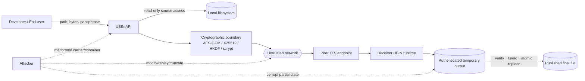

# UBIN v1.0.1 Security Model

## Security principles

UBIN uses established building blocks:

- TLS 1.3 for transport confidentiality/integrity and server certificate authentication
- X25519 for ephemeral application key agreement
- HKDF-SHA256 for key separation
- AES-256-GCM for authenticated encryption
- SHA-256 for exact-restoration verification
- scrypt for passphrase-to-master-key derivation in the PNG carrier
- HMAC-SHA256 for authenticated resumable-transfer tickets

**KRP is only a reversible ciphertext-layout transform. It is not advertised as cryptographic strength and must never replace authenticated encryption.**

## Threat model

### Assets

UBIN aims to protect:

- plaintext file contents during secure storage/transfer
- exact byte identity of reconstructed outputs
- session/transfer encryption keys
- resume state and authenticated progress
- carrier metadata that affects reconstruction

### Attacker capabilities considered

The design assumes an attacker may be able to:

- observe, delay, replay, truncate, reorder, or modify network traffic
- provide malformed `.ubs` files or malformed PNG carriers
- append/truncate/bit-flip carrier/container bytes
- submit a wrong passphrase or encryption key
- interrupt a transfer and attempt to manipulate resume state
- rename files or use unknown/custom filename extensions

UBIN does **not** assume it can protect plaintext from a fully compromised endpoint, malicious Python interpreter, compromised OS/kernel, stolen passphrase, stolen private TLS key, hardware failure, or an attacker already able to read process memory.

## Trust boundaries

### Boundary interpretation

1. **Input boundary:** arbitrary bytes are untrusted until parsed/validated.
2. **Cryptographic boundary:** plaintext is not accepted from encrypted frames until AES-GCM authentication succeeds.
3. **Network boundary:** the network is untrusted; TLS certificate verification and authenticated UBIN frames are required.
4. **Resume boundary:** a checkpoint represents only authenticated, durably written progress.
5. **Publication boundary:** incomplete or failed output remains temporary; the final pathname appears only after verification succeeds.

## Fail-closed behavior

Malformed/tampered input raises controlled UBIN errors and should not publish a successful destination. Important flows use temporary files, `fsync`, and atomic replacement.

Examples covered by tests/fuzzing include:

- wrong AES key
- wrong image passphrase
- modified/truncated encrypted container
- PNG CRC corruption
- arbitrary/truncated PNG parser input
- transformed/non-filter-0 UBIN carrier PNG
- tampered resume tickets
- changed source between interrupted transfer attempts
- corrupted partial resume state

## Nonce and key separation

- AES-GCM nonces are 96 bits.
- A fresh random nonce base is generated for each secure container/transfer context.
- Per-frame nonces are deterministically derived from that base and the frame number, so frame nonces within one transfer are unique.
- Network reconnection establishes fresh session material; resumability does not require persisting the old raw AES key.
- HKDF separates encryption and KRP keys so the same raw key material is not reused for unrelated purposes.

See [`DESIGN_DECISIONS.md`](DESIGN_DECISIONS.md) for rationale.

## PNG carrier

The carrier is lossless only when PNG pixels remain unchanged. Resizing, color conversion, JPEG conversion, screenshots, or editing are not UBIN carrier operations. A transformed/tampered carrier is rejected.

A wrong passphrase must fail authentication. The passphrase is never stored in the PNG.

## Password/passphrase quality

scrypt increases the cost of guessing but cannot make a weak passphrase strong. Use a long, unique passphrase and protect it independently from the carrier.

## TLS certificates

`generate_localhost_certificate()` is strictly a demo/test helper. Real deployments should use their organization/platform PKI, private-key controls, certificate rotation, and hostname verification.

## Automated assurance in v1.0.1

The repository includes:

- multi-OS/multi-Python CI
- line coverage enforcement and Codecov upload
- Ruff static checks
- Bandit security linting
- Semgrep CE scanning
- `pip-audit` dependency vulnerability scanning
- machine-readable security reports retained as GitHub Actions artifacts
- Hypothesis property-based tests
- Atheris coverage-guided fuzz harnesses for KRP and PNG parsing

These improve confidence but **do not constitute an independent security audit or formal verification**. Independent review remains recommended before high-value production deployment.

## Security reporting

Do not disclose a suspected vulnerability in a public issue. Use GitHub's private vulnerability reporting / security advisory flow for this repository:

`https://github.com/suryaganesh0509/UBIN/security/advisories/new`

Include the affected version, minimal reproduction, impact, and whether secrets or real user data are involved. Do not attach real credentials/private keys.

## Non-goals / limitations

- No guarantee against OS termination, filesystem/hardware failure, interpreter/runtime compromise, or endpoint compromise.
- v1 does not claim post-quantum key establishment.
- UBIN does not claim arbitrary large input can be compressed to a fixed tiny image.
- The Python package is the reference implementation; cross-language interoperability requires a separately frozen wire-format compatibility specification and conformance suite.
